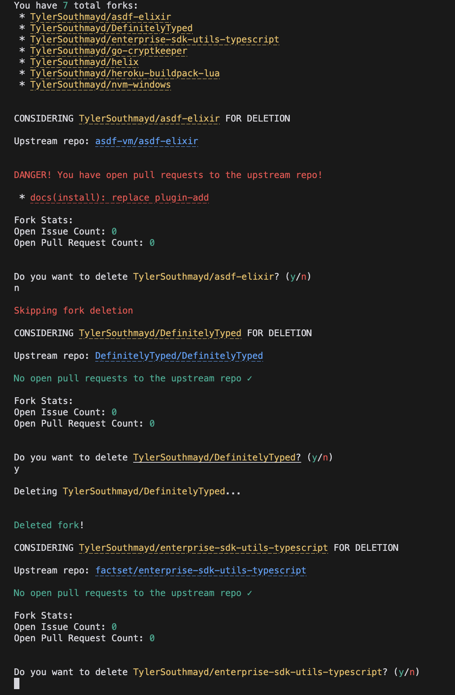

# Fork Cleaner

CLI tool to delete your old forks.

Fetches your forked GitHub repositories, then prompts for their individual deletion.

Provides additional information about each fork to help inform your decision.

## Env vars

- `GITHUB_ACCESS_TOKEN`: required
  - PAT with `repo` and `delete_repo` scopes
- `GITHUB_HOST`: optional
  - default: `https://api.github.com`
  - override for enterprise users (e.g. `https://api.github.company.com`)

## Usage

```sh
# install deps
mix deps.get

# dev
GITHUB_ACCESS_TOKEN=$GITHUB_ACCESS_TOKEN GITHUB_HOST=$GITHUB_HOST iex -S mix

# build
MIX_ENV=prod mix escript.build

# run
GITHUB_ACCESS_TOKEN=$GITHUB_ACCESS_TOKEN ./fork_cleaner
```

## Example output:

